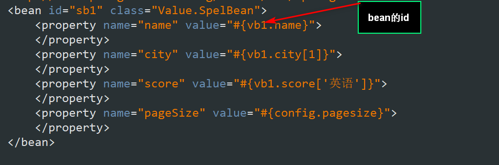
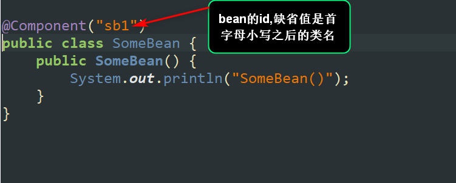
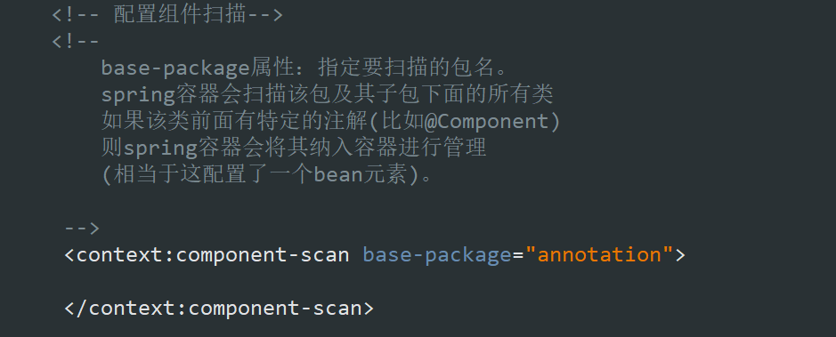
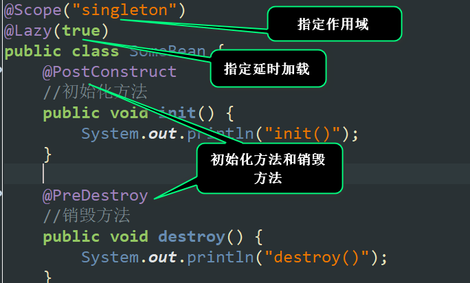

#{Jquery选择器——:eq()的使用注意事项（后面加变量的情况下）}
## 1.spring框架  
是一个开源的用来简化应用开发的框架  
### 1.1简化开发  
spring对常用的API做了封装和简化(例如对jdbc做了封装,使用spring jabc访问数据库，就不需要考虑获取连接和关闭连接了) 
### 1.2管理对象  
spring提供一个容器，建立依赖关系，降低代码的耦合度  
### 1.3集成其它的框架  
任务调度 quartz框架  不发明重复的轮子,spring可以将其它的一些框架集成进来。  
## 2.spring容器
### 2.1spring容器  
spring框架中的一个核心模块,用于管理对象。  
### 2.2启动spring容器  
step1.导包-(spring-webmvc)  
step2.添加配置文件-applicationContext.xml  
step3.启动spring容器  
### 2.3如何创建对象？
方式一 使用无参构造器(重点) 
step1.给类添加无参构造器(或者缺省构造器)  
step2.配置<bean>元素  
step3.调用容器的getBean方法获得对象  
方式二 使用静态工厂方法  
通过调用类的静态方法来创建对象  
方式三 使用实例工厂方法  
通过调用对象的实例方法来创建对象  
### 2.4作用域  
默认情况下，容器对于某个bean，只会创建一个实例 
可以通过scope属性的ptototype，这样，容器对于某个bean会创建多个实例。  
### 2.5生命周期(重点)  
初始化 分配资源 销毁 释放资源  
初始化方法：使用init-method属性来指定初始化方法名 
注：spring容器创建对象之后，会立即调用初始化方法。  
 
销毁的方法：使用destory-method属性来指定销毁的方法名  
注：spring容器关闭之前，会先销毁对象，在销毁对象之前，会先调用对象的销毁方法。 只用作用为单例的时候才会执行。 

### 2.6延迟加载
spring容器启动之后，会将所有的作用域为单例的bean创建好 
指定lazy-init属性值为true,此时，spring容器对于作用为单例的bean，就不会创建相应的实例了。 

## 3.IOC(Inversion Of Controll 控制反转)
### 3.1 IOC是什么?  
对象之间的依赖关系由容器来建立。 
### 3.2 DI(Dependency Injection 依赖注入)
容器通过调用对象提供的set方法或者构造器来建立依赖关系。 
注：IOC是目标，DI是手段。 
### 3.3set方式注入
step1.提供相应set方法  
step2.配置property元素。  
### 3.4构造器方式注入
step1.添加相应的构造器。 
step2.配置 constructor-arg 元素 
### 3.5自动装配
spring容器依据某种规则，自动建立对象之间的依赖关系 
注意：
a.默认情况下容器不会自动装配  
b.可以通过指定autowire属性告诉容器进行自动装配(容器仍然需要通过调用set方法或者构造器来完成依赖关系建立)  
### 3.6注入基本类型的值
使用value属性即可。 
### 3.7注入集合类型的值(List Set Map Properties)四类集合
### 3.8引用的方式注入集合的值
### 3.9读取properties文件内容
### 3.10使用spring表达式
可以使用spring表达式读其他bean的属性，它的语法类似于el表达式
-#{user.name}-读属性值 

#插入图片

##使用注解简化配置
### 1.组件扫描
spring 容器在启动之后，会扫描指定的包及其子包下面所有的类，如果该来前面有特定的注解(比如@component),则spring容器会将该注解纳入容器进行管理(相当于在配置文件中配置了bean元素)
### 2.组件扫描
step1. 在类前面添加特定的注解。 
注：除了@Component注解，还有@Service,@Repository和@Controller,作用是等价的只不过是语义上的差异。 
 
step2. 要在配置文件中,添加扫描组件的配置。 

### 3.其它相关注解

### 4.依赖注入相关的注解
#### @Autowired 和 @Qualifier
a. 该注解支持set方式注入和构造器方式注入
b. 当采用set方式注入时，可以将@Autowired添加到set方法前面，如果不使用@Qualifier，则容器会使用byType的方式来注入，有可能出错，所以建议使用@Qualifier注解，明确指出要注入的bean的id。 
注：也可以直接将注解加到属性前面 
c. 当采用构造器注入时，可以将该注解添加到对应的构造器前面即可。 
### @Resourse
a.支持set方式注入。 